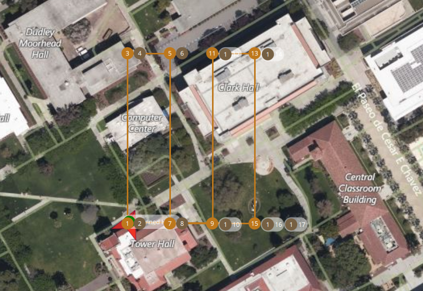

# Multi-agent drone exploration
This project contains code for wildfire exploration with a swarm of simulated drones.

# Quickstart
Clone the repository
```shell
git clone https://github.com/tomek-l/drone-scan.git
cd drone-scan
git submodule update --init --recursive
```

Install the required python packages
```shell
pip3 install -r requirements.txt
```

Run the simulation:
```shell
python3 scan_fleet_simulation.py
```

<!-- 
# Run with MAVLINK drones (work in progress)

Install mavsdk
```
pip3 install mavsdk
```

Run a docker container with a simulated PX4 drone:

```shell
docker run --rm -it --env PX4_HOME_LAT=37.335404 --env PX4_HOME_LON=-121.883400 --env PX4_HOME_ALT=488.0 jonasvautherin/px4-gazebo-headless:v1.10.1
```

Run mavproxy

```shell
mavproxy.py --master=udp:0.0.0.0:14550 --out=udp:localhost:14551 --out=udp:localhost:14552
```

Run the script
```
python3 scan_with_mavlink_drone.py
```

This will do a few things:

- start a wildfire simulation
- connect to the drone
- generate trajectory for the drone
- sample the space with a given interval

 -->